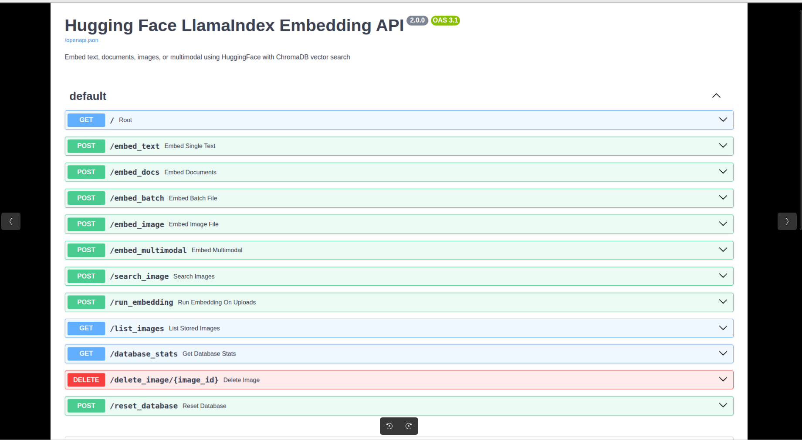
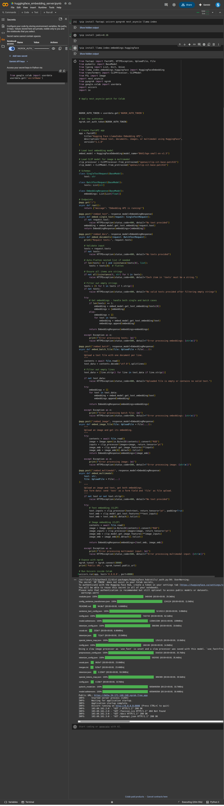

# Hugging Face Local Embedding

A FastAPI server that provides local text and multi-modal embedding using LlamaIndex and Hugging Face Embedding models. Supports text, document, and image embedding via API endpoints. Easily deployable locally, with Docker, or on Google Colab.

---

## Project Structure

```
huggingface-local-embedding/
├── README.md                           # Project documentation
├── requirements.txt                    # Python dependencies
├── Dockerfile                          # Docker configuration
├── docker-compose.yml                  # Docker Compose configuration
├── huggingface_embedding_server.py     # Main FastAPI application
├── huggingface_embedding_server.ipynb  # Jupyter notebook version
├── LICENSE                             # MIT License
└── .gitignore                          # Git ignore rules
```

---

## Features
- Local text and multi-modal (image, text) embedding
- FastAPI server with REST endpoints
- Uses LlamaIndex and Hugging Face models
- Docker and Colab ready
- Python 3.13.3 compatible

---

## Demo




## Prerequisites

- Python 3.13.3 or higher
- Docker (optional, for containerized deployment)
- ngrok account (optional, for public URL exposure)

---

## Setup Guide

### 1. Standalone (Local) Setup

#### Using pip

- Create a virtual environment and install dependencies:
```bash
python3.13 -m venv venv
source venv/bin/activate
pip install -r requirements.txt
uvicorn huggingface_embedding_server:app --host 0.0.0.0 --port 8000
```

#### Using [uv+pip](https://github.com/astral-sh/uv) (Fast Python package manager)

- Install uv:
  ```bash
  curl -LsSf https://astral.sh/uv/install.sh | sh
  ```

- Create a virtual environment and install dependencies:
```bash
uv venv --python 3.13
source .venv/bin/activate
uv pip install -r requirements.txt
uvicorn huggingface_embedding_server:app --host 0.0.0.0 --port 8000
```

#### Using only [uv](https://github.com/astral-sh/uv) (Fast Python package manager)

- Create a virtual environment and install dependencies:
```bash
uv sync --python 3.13
uvicorn huggingface_embedding_server:app --host 0.0.0.0 --port 8000
```


### 2. Dockerized Setup

#### Build and Run with Docker
```bash
docker build -t huggingface-embedding-server .
docker run --env-file .env -p 8000:8000 huggingface-embedding-server
```

#### Using Docker Compose
```bash
docker-compose up --build
```

### 3. Google Colab Setup

- Open `huggingface_embedding_server.ipynb` in Colab.
- Run the first cell to install dependencies:
  ```python
  !pip install fastapi uvicorn pyngrok nest_asyncio llama-index llama-index-embeddings-huggingface
  ```
- Set ngrok token in Colab secrets:
  - Go to Colab menu: `Runtime` > `Change runtime type` > `Hardware accelerator` (optional)
  - In Colab, run:
    ```python
    from google.colab import userdata
    userdata.set_secret('NGROK_AUTH_TOKEN')
    ```
- Run all cells to start the server and expose via ngrok.

---

## Setting ngrok Secrets

### In Google Colab
- Use Colab secrets:
  ```python
  from google.colab import userdata
  userdata.set_secret('NGROK_AUTH_TOKEN')
  ```
- The notebook will read the token and set it for ngrok automatically.



### Locally (.env file)
- Create a `.env` file in the project root using a copy of the `.env.example` file, and set the `NGROK_AUTH_TOKEN` to your ngrok token.

  ```bash
  cp .env.example .env
  ```

  ```env
  NGROK_AUTH_TOKEN=your-ngrok-token-here
  ```

- The Docker Compose setup will load this automatically. For local runs, you can load it in your shell:
  ```bash
  export $(cat .env | xargs)
  ```
  
- Or set the token in your Python code before starting ngrok:
  ```python
  import os
  from pyngrok import ngrok
  ngrok.set_auth_token(os.getenv('NGROK_AUTH_TOKEN'))
  ```

---

## API Endpoints

- `GET /` — Health check
- `POST /embed_text` — Embed a single text
- `POST /embed_docs` — Embed a list of texts
- `POST /embed_image` — Embed an image
- `POST /embed_batch` — Upload a text file for batch embedding
- `POST /embed_multimodal` — Embed text and image together

---

## Notes
- For Hugging Face model access, you may need to set `HF_TOKEN` as a Colab secret or environment variable if using private models.
- For best performance, use a machine with sufficient RAM and CPU/GPU for model inference.
- This project is tested with Python 3.13.3 but should work with Python 3.11+.

---

## License

MIT License. See [LICENSE](LICENSE).

---

## Contributing
To contribute, please fork the repository and submit a pull request. If you have any questions, please contact me at sany2k8@gmail.com or create an issue with the tag `enhancement` or `bug`.

## Credits
- [LlamaIndex](https://github.com/run-llama/llama-index)
- [Hugging Face](https://huggingface.co/)
- [FastAPI](https://fastapi.tiangolo.com/)
- [Uvicorn](https://www.uvicorn.org/)
- [Pyngrok](https://github.com/ngrok/pyngrok)

---

## TODO
- [ ] Add a way to upload a file and embed it
- [ ] Add a way to embed a text file
- [ ] Add a way to embed a pdf file
- [ ] Add a way to embed a csv file
- [ ] Add a way to embed a json file
- [ ] Add a way to embed a txt file
- [ ] Add a way to embed a docx file

## Contact

- [LinkedIn](https://www.linkedin.com/in/md-sany-ahmed-9ab00745/)
- [Email](mailto:sany2k8@gmail.com)
- [Website](https://sany2k8.github.io/)
- [GitHub](https://github.com/sany2k8)